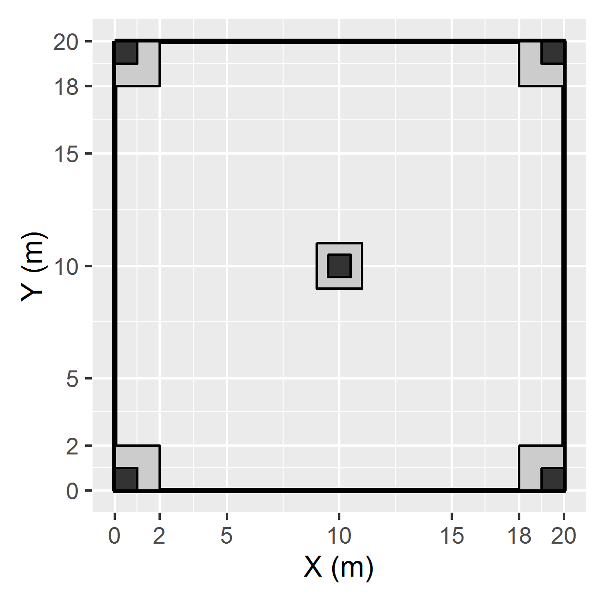

##Design of the sample plot. 
The plot size was 20 × 20 m. The entire plot was used for recording the tree
species (diameter at breast height ≥ 5.0 cm). Each plot contained
five subplots of 2 × 2 m for recording the shrub layer and regenerating
species (diameter at breast height < 5.0 cm), one in each
corner and one in the center of the main plot. Each of these subplots
contained another subplot of 1 × 1 m for recording the herb-layer
species. 

```{r}
library(ggplot2)
P<-ggplot(aes(x=x,y=y),data=data.frame(x=c(0,20,20,0),y=c(0,0,20,20)))+
  geom_rect(aes(xmin=0,xmax=20,ymin=0,ymax=20), fill=alpha(0.2),
            colour="black",size=1)+ coord_fixed()+
  xlab("X (m)")+ylab("Y (m)")+
  scale_y_continuous(breaks=c(0,2,5,10,15,18,20))+
  scale_x_continuous(breaks=c(0,2,5,10,15,18,20))+
  geom_rect(aes(xmin=c(0,18,18,0),
                xmax=c(2,20,20,2),
                ymin=c(0,0,18,18),
                ymax=c(2,2,20,20)),fill = grey(0.8),colour="black")+
  geom_rect(aes(xmin=9,
                xmax=11,
                ymin=9,
                ymax=11),fill = grey(0.8),colour="black")+
  geom_rect(aes(xmin=c(0,19,19,0),
                xmax=c(1,20,20,1),
                ymin=c(0,0,19,19),
                ymax=c(1,1,20,20)),fill = grey(0.2),colour="black")+
  geom_rect(aes(xmin=9.5,
                xmax=10.5,
                ymin=9.5,
                ymax=10.5),fill = grey(0.2),colour="black")
##ggsave("samplot.png",width=8,height=8,unit="cm", dpi=400)
```

