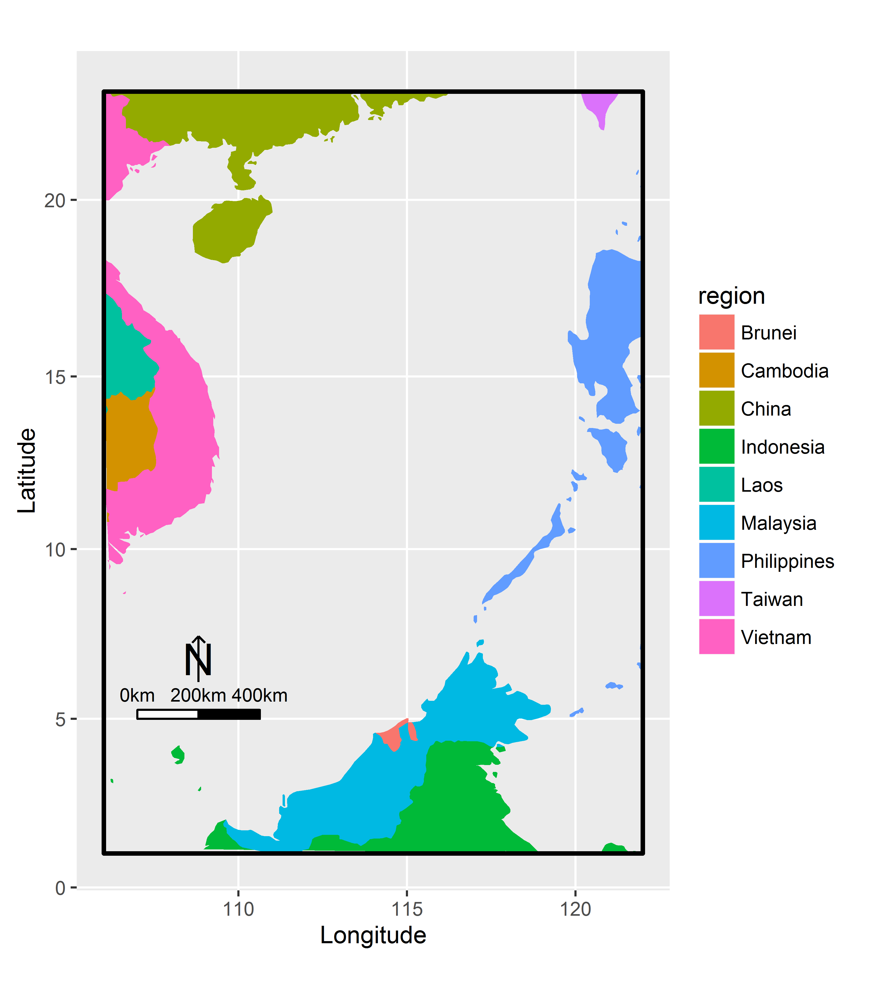

## Drawing a map for south ocean

```{r}
library(maps)
library(ggplot2)
world_map <- map_data("world")
southocean<-subset(world_map,long>=106&long<=122&lat>=1&lat<=23)
southocean$country<-southocean$region
southocean$country[which(southocean$region=="Taiwan")]<-"China"
southocean$nation<-southocean$country
southocean$nation[which(southocean$country!="China")]<-"Other countries"
southocean.p<-ggplot()+
  labs(x = "Longitude", y = "Latitude")+
  geom_polygon(data=southocean, aes(x = long, y = lat,group=group,fill=region))+coord_map()+
  geom_rect(data=southocean,xmin=min(southocean$long),xmax=max(southocean$long),
            ymin=min(southocean$lat),ymax=max(southocean$lat),
            color="black",fill=NA,size=1)
#add the north arrow and scalebar for the map
source("http://www.forest-soil.net/Upload/ueditor/file/20160326/1458958424403207.txt")
southocean.pA<-southocean.p+ 
  scaleBar(lon = 107, lat = 5, distanceLon = 200, 
                      distanceLat = 30, distanceLegend = 80, 
                       dist.unit = "km",arrow.length = 150, 
           arrow.distance = 120, arrow.North.size = 7)
##ggsave("southocean.png",width=14,height=16,unit="cm", dpi=600)
southocean.pA
```

 
