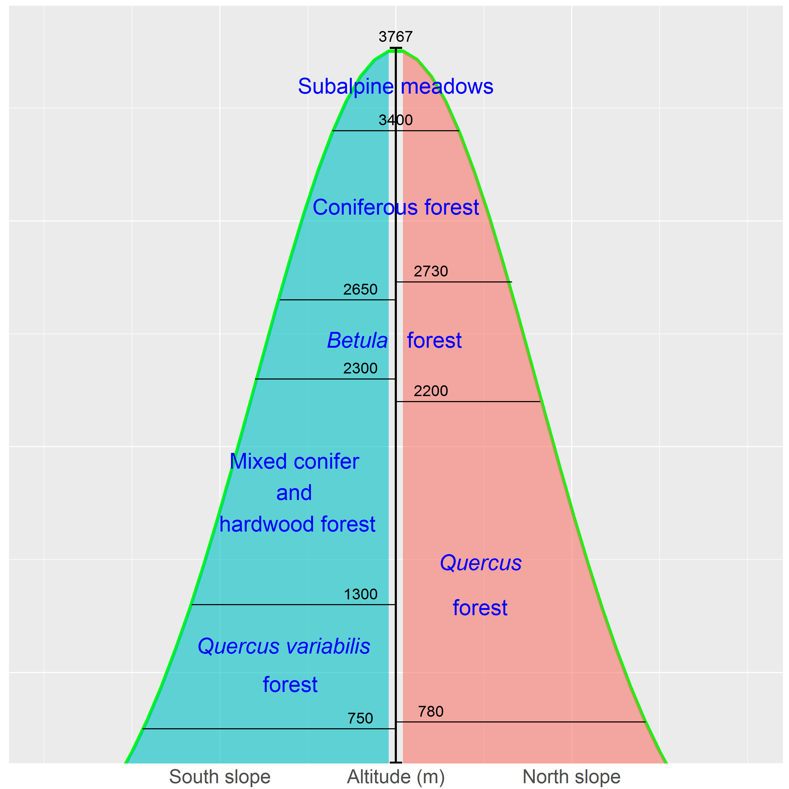

The vertical vegetation zones show the general
model for Taibai Mountain, the highest peak in Qinling Mountains,
with a summit altitude of 3767 m.

```{r}
library(ggplot2)
x <- seq(-2,2,length.out=100)
y <- dnorm(x,0,0.4)*3767
mtdata<-as.data.frame(cbind(x,y))
mtdata$slope[mtdata$x<=0] <- "south"
mtdata$slope[mtdata$x>0] <- "north"
pzone<- ggplot(mtdata,aes(x=x,y=y))+geom_line(size=1.5,color="green")+
        coord_cartesian(ylim = c(750, 3800),xlim=c(-1,1))+
        geom_area(aes(fill=slope), alpha = .6)+ guides(fill=FALSE)+
        scale_x_continuous(breaks=c(-0.5,0,0.5),
                     labels=c("South slope","Altitude (m)","North slope"))+
  annotate("segment", x=0, xend=0, y=600, yend=3767,size=1,color="black",
           arrow=arrow(ends="both", angle=90,length=unit(.2,"cm")))
pzone1<-pzone+annotate("segment", x=-0.72, xend=0, y=750, yend=750,size=0.5)+
  annotate("segment", x=-0.58, xend=0, y=1300, yend=1300,size=0.5)+
  annotate("segment", x=-0.4, xend=0, y=2300, yend=2300,size=0.5)+
  annotate("segment", x=-0.33, xend=0, y=2650, yend=2650,size=0.5)+
  annotate("segment", x=-0.18, xend=0.18, y=3400, yend=3400,size=0.5)+
  annotate("segment", x=0, xend=0.33, y=2730, yend=2730,size=0.5)+
  annotate("segment", x=0, xend=0.41, y=2200, yend=2200,size=0.5)+
  annotate("segment", x=0, xend=0.71, y=780, yend=780,size=0.5)
pzone2<-pzone1+annotate("text", x=-0.1, y=800, size=5,label="750")+
  annotate("text", x=-0.1, y=1350, size=5,label="1300")+
  annotate("text", x=-0.1, y=2350, size=5,label="2300")+
  annotate("text", x=-0.1, y=2700, size=5,label="2650")+
  annotate("text", x=0, y=3450, size=5,label="3400")+
  annotate("text", x=0, y=3820, size=5,label="3767")+
  annotate("text", x=0.1, y=2780, size=5,label="2730")+
  annotate("text", x=0.1, y=2250, size=5,label="2200")+
  annotate("text", x=0.1, y=830, size=5,label="780")
pzone3<-pzone2+annotate("text", x=-0.32, y=1120, size=7,color="blue",label="Quercus variabilis",fontface="italic")+
  annotate("text", x=-0.30, y=950, size=7,color="blue",label="forest")+
  annotate("text", x=-0.28, y=1800, size=7,color="blue",label="Mixed conifer \nand \nhardwood forest")+
  annotate("text", x=-0.11, y=2475, size=7,color="blue",label="Betula",fontface="italic")+ 
  annotate("text", x=0.11, y=2475, size=7,color="blue",label="forest")+
  annotate("text", x=0, y=3600, size=7,color="blue",label="Subalpine meadows")+
  annotate("text", x=0, y=3065, size=7,color="blue",label="Coniferous forest")+
  annotate("text", x=0.24, y=1490, size=7,color="blue",label="Quercus",fontface="italic")+
  annotate("text", x=0.24, y=1290, size=7,color="blue",label="forest")
pzone4<-pzone3+theme(axis.text.x = element_text(size=rel(2.0)),axis.title.x=element_blank(),
      axis.text.y = element_blank(),axis.title.y=element_blank(),axis.ticks = element_blank())
pzone4
#ggsave("vegzoneQL.png", pzone4, width=10, height=10)
```

##Reference:
1. Zhao XG, Ma CH, and Xiao L. 2014. The vegetation history of Qinling Mountains, China. Quaternary International 325:55-62.
2. Chai ZZ, Wang DX. 2016. A comparison of species composition and community assemblage of secondary forests between the birch and pine-oak belts in the mid-altitude zone of the Qinling Mountains, China. PeerJ, 4:e1900.DOI:10.7717/peerj.1900.<https://peerj.com/articles/1900/>
